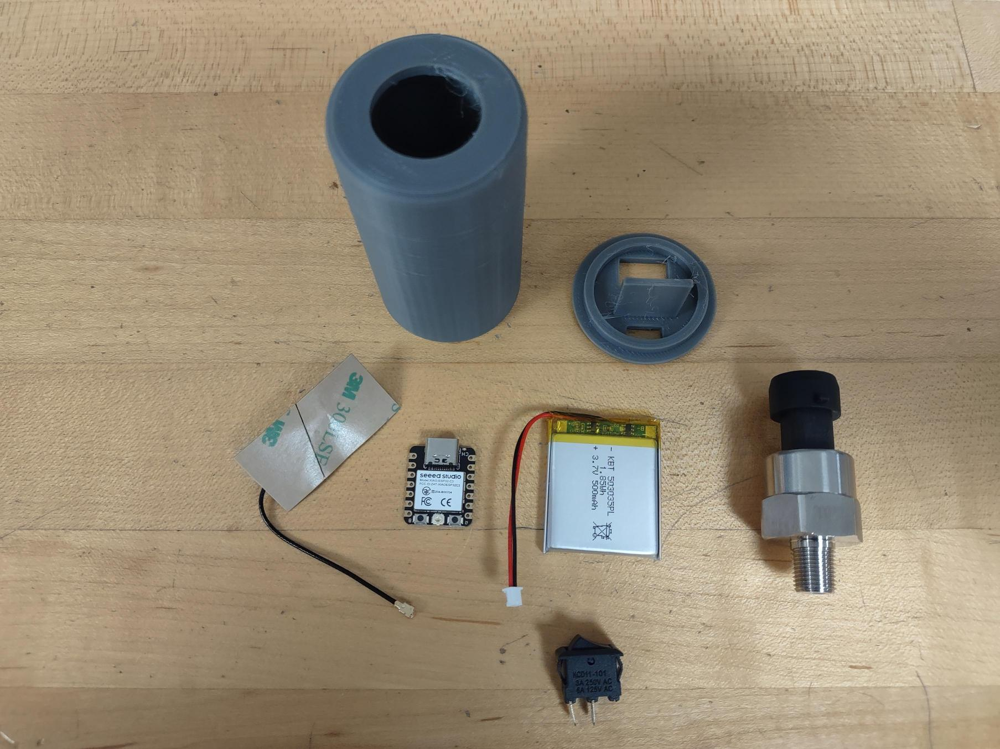
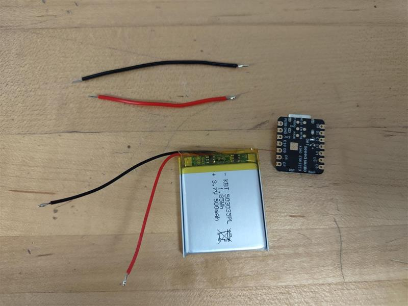

# Consistent-Cups-Espresso-Accessories
Open Source DIY solution to create Bluetooth-compatible pressure sensor and scale to use with a manual espresso machine. 

## Table of Contents
- [Consistent-Cups-Espresso-Accessories](#consistent-cups-espresso-accessories)
   - [Table of Contents](#table-of-contents)
   - [Project Background and Introduction](#project-background-and-introduction)
      - [Semi-Automatic Espresso Machines](#semi-automatic-espresso-machines)
      - [Manual Espresso Machines](#manual-espresso-machines)
   - [Description of Solution](#description-of-the-solution)
      - [Bill of Materials](#bill-of-materials)
   - [Pressure Sensor](#pressure-sensor)
      - [Components Used](#components-used)
      - [Casing Files](#casing-files)
      - [Assembly Instructions](#assembly-instructions)
   - [Scale](#scale)
      - [Components Used](#components-used-1)
      - [Casing and PCB Files](#casing-and-pcb-files)
      - [Assembly Instructions](#assembly-instructions-1)
   - [Connecting with Profiler Apps](#connecting-with-profiler-apps)

## Project Background and Introduction

The market for espresso machines is a vastly large and competitive one. Every individual has their own preferences and lifestyles which result in the need for different machines. There are so many methods for making espresso that vary significantly in user effort, time, and price. 

### Semi-Automatic Espresso Machines

Automatic machines require little user effort and time to extract an espresso shot. However, the large downside to these machines is that, generally speaking, they cost upwards of $300-400 depending on the additional features and components they have. Once the grinds are tamped in the portafilter, the machine automatically applies the pressure for the duration of time that can sometimes be specified by the user.  

 

Figure 1: Semi-Automatic Espresso Machine Example 

### Manual Espresso Machines

Manual espresso machines require a significant amount of preparation, time, and effort. These machines are generally cheaper than their automatic counterparts, being found for upwards of $100. For these machines, once the grinds are tamped in the portafilter, the user must also heat their water to the desired temperature. The user then needs a scale underneath the cup to be able to see how fast they are extracting the espresso. After pulling the lever and applying pressure for a set amount of time, the extraction is finally complete. The downsides to this machine are the extensive clean-up time and the loss of water temperature during the extraction. However, this machine allows the user to have complete control over the amount of pressure and time variables for making their own ideal cup of espresso, perfect for connoisseurs. With the pressure transducer and scale, it would be even easier to repeat their results or tweak them to their preferences. An example of what this type of machine looks like is in the right image of Figure 3. 

 

Besides the bean and how it's roasted, a good cup of lever espresso relies on three main factors: Pressure, temperature, and speed of the pull.  The speed of pull is determined by the grind size of the bean and the pressure.  Pressure is controlled by pulling the machine's handle.  A monitor system lets you track and save the pressure and pull speed data to a template.  You can then follow the template when doing a future pull, enabling consistent tasting espresso. 

The downside to such systems is the cost.  An entry-level scale like the Acaia Lunar Espresso Scale is $250, and the pressure gauge is $460 from naked-portafilter (both pictured below). 

Figure 2: Naked Portafilter Smart Espresso Profiler 

Figure 3: Acaia Lunar Espresso Scale 

## Description of the solution

The market for espresso machines is a vastly large and competitive one. Every individual has their own preferences and lifestyles which result in the need for different machines, which vary significantly in user effort, time, and price.  Manual lever espresso machines offer an affordable entrance into brewing quality espresso at home.  A monitor system helps the novice get consistent pulls of espresso by tracking and logging variables like pressure and speed of pull. The existing market design for the pressure sensor is $400 and the scale is $200, a steep cost that ends up at the same price level as some higher-end automatic machines. The design group would need to make an open-source pressure sensor and scale system that could wirelessly connect to the SE Profiler or Coffee Flow phone app, create a GitHub repository with schematics, bill of materials, 3D printed case files, PCB files, and build instructions.  This is all accomplishable with the materials posted below in the BOM, a soldering iron, a 3D printer, and a computer!

### Bill of Materials

[BOM.xlsx](https://github.com/rhit-coultabm/Consistent-Cups-Espresso-Accessories/files/14973055/BOM.xlsx)

## Pressure sensor

Figure 6: Wiring diagram

### Components used
   - Seeduino
   - Pressure Sensor
   - Battery
   - On/off switch
   - Casing
  
   Shown here:
  

### Casing files
   
[Body](Enclosure_Files/Pressure_Sensor/pressure_base.STL)
[Cap](Enclosure_Files/Pressure_Sensor/pressure_end.STL)

### Assembly Instructions

#### Step 1: Solder Power connections

- Using the battery, two short wires, and the seeduino (shown below in figure 4) follow the wiring diagram (shown above in figure 6) connecting the battery positive (red) wire to one of the pins on the switch. Then the battery negative (black) wire to the negative pin on the back of the seeduino. Next, solder a wire from the other switch pin to the positive pin on the back of the seeduino. 
- This final product attached to the casing cap is shown below in figure 5

Figure 4: Items needed

Figure 5: final product of this step

#### Step 2: Solder Pressure Sensor
-
- Using the two figures below, wire the pressure sensor with the Vcc to pin Vcc, the ground to ground, and the output to pin D2
- Make sure that the pressure sensor is wired through the hole in the casing to the seeduino, this is to ensure that it can all be put together in the final step

Figure 7: Sensor Wiring assignments

Figure 9: Wired pressure sensors with matching colors from figure 8

Figure 10: Pressure sensor and seeduino attached and put into the casing

#### Step 3: Assemble
-
- To finalize this part of the pressure sensor, attach the antenna to the seeduino (as shown in figure 11)
- Next, fit all of the components into the casing, with seeduino on the shelf, the battery slotted into the main area of the casing, and the pressure sensor through the hole on the other side of the casing (all shown in figure 12)
- Final product is shown in figure 13 and 14

Figure 11: Attached antenna to the Seeeduino Xiao

Figure 12: How to fit the components into the case

Figure 13/14: How the casing end should look when all is completed 

## Scale

Figure 16: Wiring diagram 

### Components used
   - Seeduino
   - Load Cell
   - Battery
   - PCB
   - LCD
   - On/off switch
   - Casing
   - Header Pins

### Casing and PCB files
   
[scale_bottom.zip](https://github.com/rhit-coultabm/Consistent-Cups-Espresso-Accessories/files/14780224/scale_bottom.zip)

[FAB-Senior Design-A.5.zip](https://github.com/rhit-coultabm/Consistent-Cups-Espresso-Accessories/files/14779862/FAB-Senior.Design-A.5.zip)

To have a PCB, you could use [JLPCB](https://jlcpcb.com/?from=VGBNA&gad_source=1&gclid=CjwKCAjwh4-wBhB3EiwAeJsppDn5Pd4jk2OESbvpThskq3OpfqVmY4BNuV4RASAHVzgLXOW_oEA4fBoCTGIQAvD_BwE) or similar services. Just select 'Order Now', then upload the Gerber files provided above, select base material as FR-4, and then 'Save to cart' and continue to checkout!

### Assembly Instructions

#### Step 1: Put headers on
- 
- The conponents that are on the BOM still need header pins to properly connect in later steps so use invidiual header pins and add them to the seeduino, the LED screen, and the ADC for the load cell. (all shown below in figure 15) They are added by sticking the short side of the pin through the holes in the bottom side of the component and soldering the top to secure them.  

Figure 15: how components look after header pins are attached 

#### Step 2: Solder PCB with components 
- 
- Note that you might have to file the short ends of the PCB down a little to make a snug press fit into the casing. This was done so that any sort of glue was not needed when assembling the system.
- Before adding the seeduino to the PCB, solder two small wires to the positive and negative places on the back (shown above in figure 15) this is to add battery connections later 
- The PCB facilitates the the wiring diagram in figure 16
- Follow the PCB layout (figure 17) when placing the components, all pins should have a place if added correctly so if the holes do not line up the components are in the incorrect place.

Figure 17: Digital PCB layout

Figure 18: soldered load cell

#### Step 3: Add battery connections
- 
- Continuing to follow the wiring diagram from above
- It is probably easiest if you place the switch in the small rectangular hole on the side of the top part of the scale casing before continuting, then soldering with the switch in place 
- Connect a wire from the positive pin of the seeduino and one side of the switch. Then connect the postivie side of the battery to the other pin on the switch and the negative side of the battery to the negative pin on the seeduino.

Figure 19: Fully soldered components placed into the casing

#### Step 4: Assemble 
-
- When placing the PCB into the casing it is important to flip it upsidedown. The side with the components should be facing down into the casing. The seeduino port should stick out of the indentation and the side of the casing.
- Next the battery can be placed loose on the side of the casing with the switch, it can also be hotglued down but this inhibits quick battery changes in the future if needed
- Now the load cell needs to be added
     - On the side of the load cell there is a sticker with and arrow and this arrow should be facing opposite the inside of the casing. So if the casing is positioned like in figure 20, then the arrow will be facing the celiing.
     - Next, holding the load cell in place, flip the casing over and attach the screws into the two holes on the top.
- Finally, attach the bottom (thinner) part of the casing to the other side of the load cell with two more screws

- As a last step, we added a small piece of acrylic to the LED screen hole on the top of the casing with hotglue or other adhesive. Be careful with super-glue that may cause the acrylic to appear cloudy as the adhesive dries. This is to help water proof the system so that none of the components are damaged if water or coffee gets into th system. 

Figure 20: Fully assembled top of enclosure

Figure 21: Fully assembled scale

## Connecting with Profiler Apps

The apps used to interface with this system are called SE Profiler and Pressensor CF. Both of which are available on Apple and Android smart phones. 

The first step into using your system is to charge the batteries. To do this: 
- Plug a type c connecter into the seeduino port and then into the wall or a computer. This should be all that is needed to charge the system. The seeduino has automatic charging hardware that will charge the system without any added components. Charging the batteries for around ___ time will be fully charged and should last for around __ time.

The next step into using your system is to flash the seeduinos with the Arduino code provided. To do this : 
